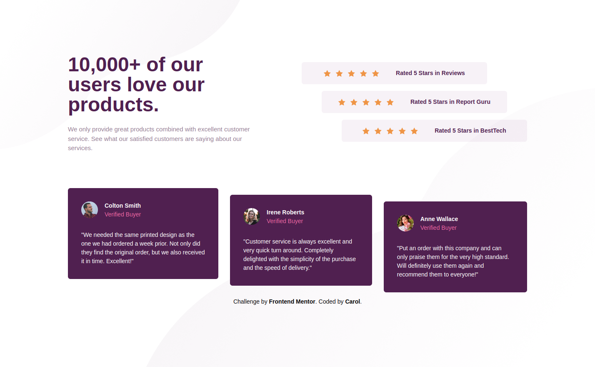

# Frontend Mentor - Social proof section solution

This is a solution to the [Social proof section challenge on Frontend Mentor](https://www.frontendmentor.io/solutions/responsive-social-proof-challenge-with-nextjs-and-tailwind-X-IxFl8Sl). Frontend Mentor challenges help you improve your coding skills by building realistic projects.

## Table of contents

- [Overview](#overview)
  - [The challenge](#the-challenge)
  - [Screenshot](#screenshot)
- [My process](#my-process)
  - [Built with](#built-with)
  - [What I learned](#what-i-learned)
  - [Continued development](#continued-development)
  - [Installation](#installation)
- [Author](#author)

## Overview

### The challenge

Users should be able to:

- View the optimal layout for the section depending on their device's screen size

### Screenshot



## My process
### Built with

- Semantic HTML5 markup
- CSS custom properties
- Flexbox
- Mobile-first workflow
- [React](https://reactjs.org/) - JS library
- [Next.js](https://nextjs.org/) - React framework
- [Tailwind](https://tailwindcss.com/) - For styles

### What I learned
In this project I use tailwind for style, so sometimes when I create a react component, I have to add some classes to the default style and this is the best way that I find to do that.

For example, I create a Card component that needs different margins depending on where it is placed, so I add a className props, that receives the additional style.

```js
export default function Card({ srcPhoto, title, description, className }) {
  return (
    <article
      className={`max-h-[248px] min-w-[327px] rounded-md bg-vd-magenta p-8 text-[14px] sm:max-h-[234px] ${className}`}
    >
      <div className='mb-7 flex space-x-4'>
        
        <div>
          <header className='font-bold text-white'>{title}</header>
          <span className='text-s-pink'>Verified Buyer</span>
        </div>
      </div>
      <p className='font-medium text-white'>{description}</p>
    </article>
  );
}
```

### Continued development

I tried to create the background using svg image, but I found it harder than it looks to manipulate them. So I intend to see and study better how this would work for a future project.

## Installation

1. Clone repository
```
git clone https://github.com/carolandrade1/social-proof-section.git && cd social-proof-section
```

2. Install dependencies
```
npm install
```

3. Run application
```
npm run dev
```

4. Go to http://localhost:3000/

## Author

- Website - [carolandrade.dev](https://www.carolandrade.dev/)
- Frontend Mentor - [@carolandrades1](https://www.frontendmentor.io/profile/carolandrade1)
